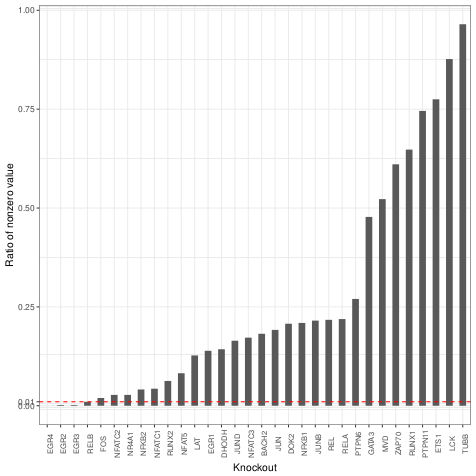
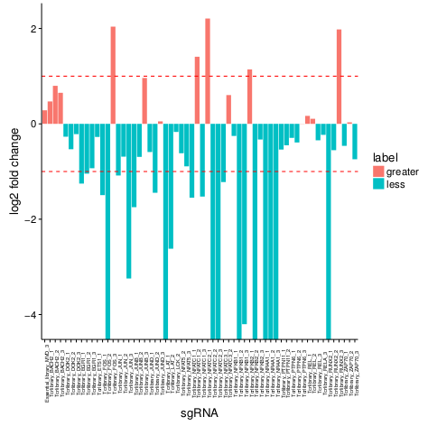
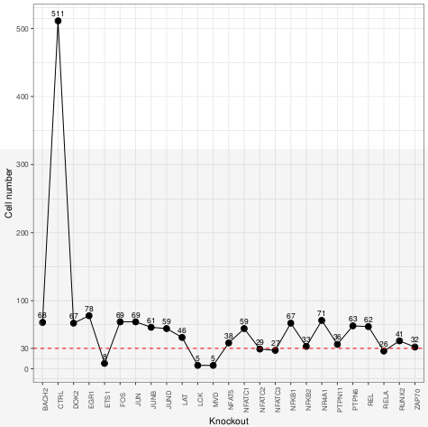
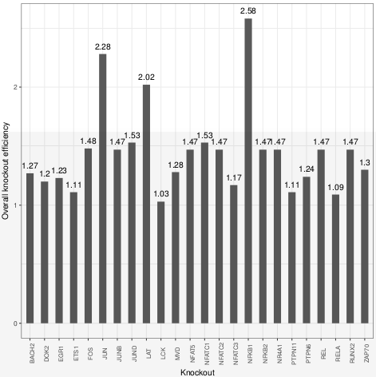
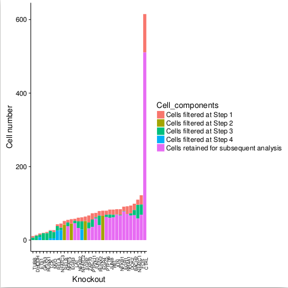
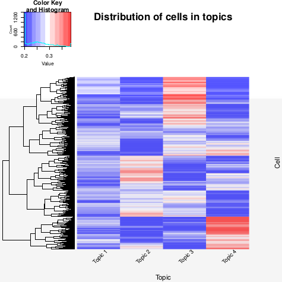

# MASCOT: **M**odel-based **A**nalysis of **S**ingle-cell **C**RISPR knock**O**u**T** screenin

* **MASCOT** is the first one-step applicable pipeline based on topic model to analyze single-cell CRISPR screening data (independently termed **Perturb-Seq**, **CRISP-seq**, or **CROP-seq**), which could help to prioritize the knockout gene impact in a cellular heterogeneity level.
* **MASCOT** is an integrated pipeline for model-based analysis of single cell CRISPR knockout screening data. **MASCOT** consists of three steps: **data preprocessing**, **model building** and **perturbation effect prioritizing**: 
    * **Data preprocessing**: Besides the routine quality control and data normalization applied in single-cell RNA-seq analysis, **MASCOT** addresses several considerations that should be taken into account for such a novel data type: **(1)** Filtering out cells with an extremely large proportion of zero knockout expression among the control cells, as these cells are inherently noisy or meaningless. **(2)** Reducing the false positive rate of gene knockout and **(3)** Filtering out knockout cells without a sufficient number of cells to capture the corresponding perturbation phenotype.
    * **Model building**: **MASCOT** builds an analytical model based on Topic Models to handle single-cell CRISPR screening data. The concept of topic models was initially presented in machine learning community and has been successfully applied to gene expression data analysis. A key feature of topic model is that it allows each knockout sample to process a proportion of membership in each functional topic rather than to categorize the sample into a discrete cluster. Such a topic profile, which is derived from large-scale cell-to-cell different knockout samples, allows for a quantitative description of the biologic function of cells under specific gene knockout conditions. **MASCOT** addresses several specific issues when applying the topic model to this specific data type: **(1)** Differences between sgRNA knockout efficiencies are considered and rectified in the evaluation of the knockout effect on the corresponding cells; **(2)** The distribution of topics between cases and controls is affected by the ratio of their sample numbers, and such a sample imbalance issue is addressed when evaluating the knockout effect. **(3)** The optimal topic number is automatically selected by MASCOT in a data-driven manner.
    * **Perturbation effect prioritizing**: Based on the model-based perturbation analysis, **MASCOT** can quantitatively estimate and prioritize the individual gene knockout effect on cell phenotypes from two different perspectives, i.e., prioritizing the gene knockout effect as an overall perturbation effect, or in a functional topic-specific way. 
* **Input File Format**. For running **MASCOT**, the input data are needed to follow the standard format we defined. For convenience, **MASCOT** accepts two kinds of input data formats: **(1)** The first data format can be referred in the **data_format_example/crop_unstimulated.RData** we provided. It is an example dataset containing "crop_unstimulated_expression_profile", "crop_unstimulated_sample_info_gene" and "crop_unstimulated_sample_info_sgRNA". You can apply function "Input_preprocess()" to handle this data format; **(2)** The second data format can be referred in the **data_format_example/perturb_GSM2396857/** generated by 10X genomics. The directory **data_format_example/perturb_GSM2396857** contains "barcodes.tsv", "genes.tsv", "matrix.mtx", "cbc_gbc_dict.tsv" and "cbc_gbc_dict_grna.tsv". You can apply function "Input_preprocess_10X()" to handle this data format. 
* **Attention:** **(1)** The label of the control sample needs to be "CTRL", and the name of the nontargeting sgRNA needs to be CTRL_xxx or xxx_CTRL_xxx; **(2)** The name of targeting sgRNA should like this: targetingGene_xxx or xxx_targetingGene_xxx. Although most single-cell CRISPR screening datasets are in accordance with our regulations, users are encouraged to check it beforehand.  
* For illustration purpose, we only took the unstimulated cell data applied in CROP-seq as an example.
    * Install: R>=3.4.1. you can install the **MASCOT** package from Github using **devtools** packages.
    ```r
    require(devtools)
    install_github("bm2-lab/MASCOT")
    library(MASCOT)
    ```
    ```r
    # take crop_unstimulated.RData as example
    dim(crop_unstimulated_expression_profile)
    ```
    ```
    ## [1] 36722  2646
    ```
    ```r
    crop_unstimulated_expression_profile[1:3,1:3]
    ```
    ```
    ##          GCAGTCCTTCTN ACGTAGGGGTAN AAACAACCGAAN
    ## A1BG                0            0            0
    ## A1BG-AS1            0            0            0
    ## A1CF                0            0            0
    ```
    ```r
    # sample_info_gene
    length(crop_unstimulated_sample_info_gene)
    ```

    ```
    ## [1] 2646
    ```
    ```r
    class(crop_unstimulated_sample_info_gene)
    head(crop_unstimalated_sample_info_gene)
    ```
    ```
    ## [1] "character"
    
    ## GCAGTCCTTCTN ACGTAGGGGTAN AAACAACCGAAN TCAGTGGCTTCT AGTATTCTCACN TTATAGCATGCA 
    ##      "NR4A1"     "NFATC2"       "CTRL"       "CTRL"       "CTRL"       "CTRL"
    ```
    ```r
    # sample_info_sgRNA
    length(crop_unstimulated_sample_info_sgRNA)
    ```
    ```
    ## [1] 2646
    ```
    ```r
    class(crop_unstimulated_sample_info_sgRNA)
    head(crop_unstimulated_sample_info_sgRNA)
    ```
    ```
    ##[1] "character"
    
    ##         GCAGTCCTTCTN          ACGTAGGGGTAN    AAACAACCGAAN   TCAGTGGCTTCT    AGTATTCTCACN    TTATAGCATGCA  
    ## "Tcrlibrary_NR4A1_1"  "Tcrlibrary_NFATC2_1"    "CTRL00698"    "CTRL00320"     "CTRL00087"     "CTRL00640" 
    ```
   
    * The first step: data preprocessing.
    ```r
    # For "crop_unstimulated.Rdata", integrate the input data and filter mitochondrial ribosomal protein(^MRP) and ribosomal protein(^RP)
    crop_seq_list<-Input_preprocess(crop_unstimulated_expression_profile,crop_unstimulated_sample_info_gene,crop_unstimulated_sample_info_sgRNA,sample_info_batch=NULL)
    
    # For data type like "extdata/perturb_GSM2396857" generated by 10X genome, function "Input_preprocess_10X" will be suitable.Users can also change this data type to the standard format like "crop_unstimulated.Rdata", then use function "Input_preprocess()" to process it. 
    ```
    
    ```r
    # quality control
    crop_seq_qc<-Cell_qc(crop_seq_list$expression_profile,crop_seq_list$sample_info_gene,gene_low=500,species="Hs",plot=T)
    ```
    <!-- -->
    
    ```r
    
    # other filtering steps, including "zero_ratio", "sgRNA efficiency" and "phenotype capture".
    crop_seq_filtered<-Cell_filtering(crop_seq_qc$expression_profile_qc,crop_seq_qc$sample_info_gene_qc,crop_seq_list$sample_info_sgRNA,nonzero=0.01,grna_cell_num=10,fold_change=0.5,plot=T)
    ```
    <!-- -->
    <!-- -->
    <!-- -->
    <!-- -->
    
    
    ```r
    # plot cells with different component.
    component<-Plot_filtering_overview(crop_seq_list$sample_info_gene,crop_seq_qc$sample_info_gene_qc,crop_seq_filtered$nonzeroRatio,crop_seq_filtered$sample_info_gene_qc_zr_se,crop_seq_filtered$sample_info_gene_qc_zr_se_pc)
    ```
    <!-- -->
    
    
    * The second step: model building
    ```r
    # obtain highly dispersion differentially expressed genes.
    crop_seq_vargene<-Get_high_var_genes(crop_seq_filtered$expression_profile_qc_zr_se_pc,crop_seq_filtered$sample_info_gene_qc_zr_se_pc,plot=T)
    ```
    <!-- -->
    
    ```r
    
    # get topics and select the optimal topic number automatically.
    optimal_Topics<-Get_topics(crop_seq_vargene,crop_seq_filtered$sample_info_gene_qc_zr_se_pc,plot=T)
    ```
    <!-- -->
    
    ```r
    # plot heatmap for topics profile among cells.
    Plot_cell_topic(optimal_Topics)
    ```
    <!-- -->
    
    ```r
    # annotate each topic's functions. Hs(homo sapiens) or Mm(mus musculus) are available.
    topic_func<-Topic_func_anno(optimalTopics,species="Hs",plot=T)
    ```
    <!-- -->
    
    ```r
    # get off-target information. This step won't affect the final ranking result, but just present the off-target information. In most cases, the sgRNA has no off-targets. If you do not want to consider this factor, then just skip this step. 
    library(CRISPRseek)
    library("BSgenome.Hsapiens.UCSC.hg38")
    library(TxDb.Hsapiens.UCSC.hg38.knownGene)
    library(org.Hs.eg.db)
    library(org.Mm.eg.db)
    gRNAFilePath<-"extdata/crop_unstimulated_sgrna.fa"
    crop_results <- offTargetAnalysis(inputFilePath = gRNAFilePath, findgRNAs = FALSE,findgRNAsWithREcutOnly = FALSE,findPairedgRNAOnly = FALSE, BSgenomeName = Hsapiens,txdb = TxDb.Hsapiens.UCSC.hg38.knownGene,min.score=1,scoring.method = "CFDscore",orgAnn = org.Hs.egSYMBOL, max.mismatch = 3,outputDir=getwd(), overwrite = TRUE)
    # then, check the offtargets.
    offTarget_Info<-Get_offtarget(crop_results,crop_seq_filtered$expression_profile_qc_zr_se_pc,crop_seq_filtered$sample_info_gene_qc_zr_se_pc,crop_seq_list$sample_info_sgRNA)
    
    ```
    * The third step: knockout effect prioritizing
    ```r
    # knockout effect prioritizing
    
    # calculate topic distribution for each cell
    distri_Diff<-Get_distribution_diff(optimalTopics,crop_seq_filtered$sample_info_gene_qc_zr_se_pc,crop_seq_filtered$KO_efficiency)
    
    # calculate the overall perturbation effect ranking list with offtarget_info calculated
    rank_overall_result<-Rank_overall(distri_Diff)
    #rank_overall_result<-Rank_overall(distri_Diff,offTarget_hash=offTarget_info) (if you consider off-target effect)
    
    # calculate the topic-specific ranking list 
    rank_topic_specific_result<-Rank_topic_specific(rank_overall_result$rank_overall_result_detail)
    
    ```
    * output
    ```r
    # output
    
    # output the overall perturbation effect ranking list with a summary or detailed style.
    write.table(rank_overall_result$rank_overall_result_summary,"~/rank_overall_result_summary.txt",col.names=T,row.names=F,quote=F,sep="\t")
    write.table(rank_overall_result$rank_overall_result_detail,"~/rank_overall_result_detail.txt",col.names=T,row.names=F,quote=F,sep="\t")
    
    # output the topic-specific ranking list with a summary or detailed style.
    write.table(rank_topic_specific_result$rank_topic_specific_result_summary,"~/rank_topic_specific_result_summary.txt",col.names=T,row.names=F,quote=F,sep="\t")
    write.table(rank_topic_specific_result$rank_topic_specific_result_detail,"~/rank_topic_specific_result_detail.txt",col.names=T,row.names=F,quote=F,sep="\t")

    
 
