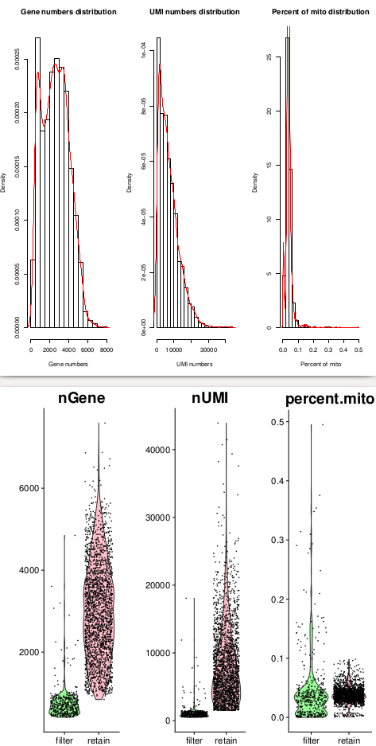
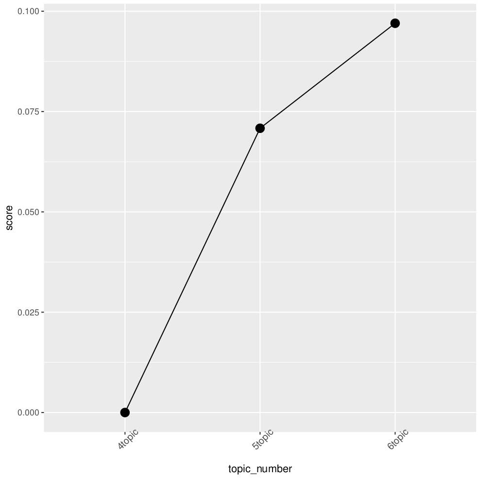
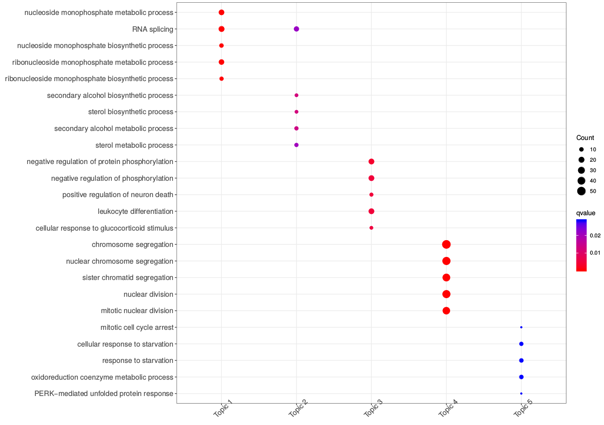
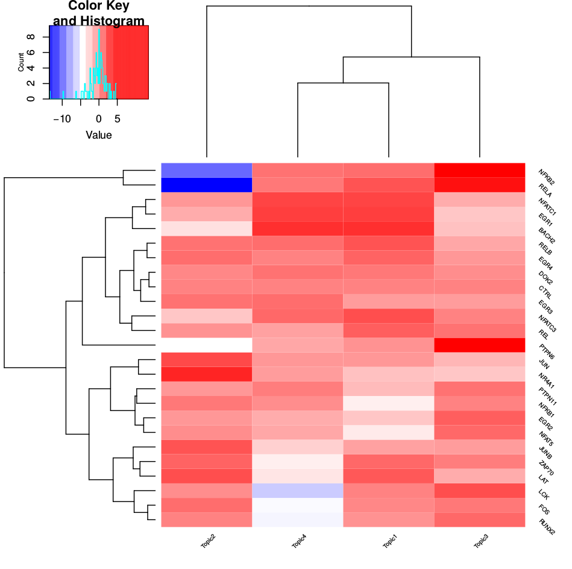
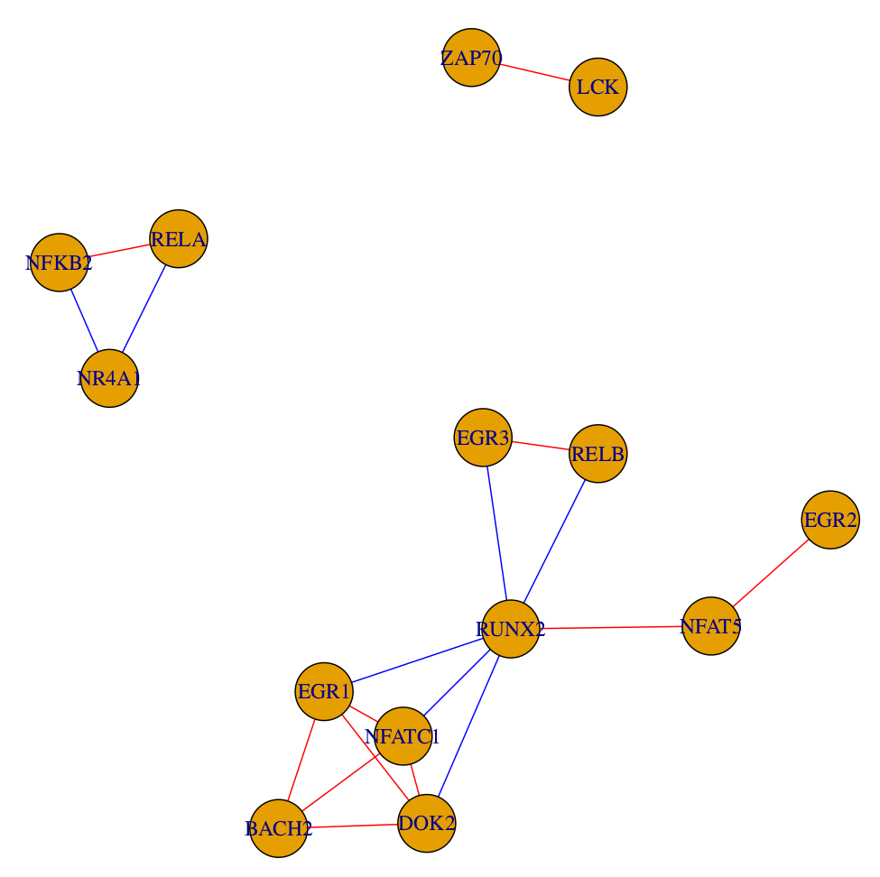

# MUSIC: Model-based Understanding of SIngle-cell CRISPR screening

* **MUSIC** is the first one-stop applicable pipeline based on topic model to analyze single-cell CRISPR screening data (independently termed **Perturb-Seq**, **CRISP-seq**, or **CROP-seq**), which could help to prioritize the gene perturbation effect in a cellular heterogeneity level.
* **MUSIC** is an integrated pipeline for model-based analysis of single cell CRISPR knockout screening data. **MUSIC** consists of three steps: **data preprocessing**, **model building** and **perturbation effect prioritizing**: 
    * **Data preprocessing**: Besides the conventional quality control and data normalization applied in single-cell RNA-seq analysis, **MUSIC** addresses two specific considerations that should be taken into account for such a novel data type: **(1)** Filtering perturbed cells with invalid edits; and **(2)** Filtering perturbations according to a minimal number of cells per perturbation.
    * **Model building**: **MUSIC** builds an analytical model based on Topic Models to handle single-cell CRISPR screening data. The concept of topic models was initially presented in machine learning community and has been successfully applied to gene expression data analysis. A key feature of topic model is that it allows each perturbed sample to process a proportion of membership in each functional topic rather than to categorize the sample into a discrete cluster. Such a topic profile, which is derived from large-scale cell-to-cell different perturbed samples, allows for a quantitative description of the biologic function of cells under specific gene perturbation conditions. **MUSIC** addresses two specific issues when applying the topic model to this specific data type: **(1)** The distribution of topics between cases and controls is affected by the ratio of their sample numbers, and such a sample imbalance issue is addressed by the bootstrapping strategy when prioritizing the perturbation effect. **(2)** The optimal topic number is automatically selected by **MUSIC** in a data-driven manner.
    * **Perturbation effect prioritizing**: Based on the model-based perturbation analysis, **MUSIC** can quantitatively estimate and prioritize the individual gene perturbation effect on cell phenotypes from three different perspectives, i.e., prioritizing the gene perturbation effect as an overall perturbation effect, or in a functional topic-specific way and quantifying the relationships between different perturbations. 
* **Input File Format**. It should be noted that considering some factors, the starting point of **MUSIC** analysis is gene expression profile data instead of fastq data. For running **MUSIC**, the input data needs to follow the standard format we defined. For convenience, **MUSIC** accepts two kinds of input data formats: **(1)** The first data format can be referred in the **data_format_example/crop_stimulated/**. You can apply function "Input_preprocess()" to handle this data format. You can format your own data according to the provided example files. **(2)** The second data format can be referred in the **data_format_example/perturb_GSM2396857/** generated by 10X genomics. The directory **data_format_example/perturb_GSM2396857** contains "barcodes.tsv", "genes.tsv", "matrix.mtx", "cbc_gbc_dict.tsv" and "cbc_gbc_dict_grna.tsv". You can apply function "Input_preprocess_10X()" to handle this data format. 
* **Attention:** The label of the control sample needs to be "CTRL".
* For illustration purpose, we took the dataset **data_format_example/crop_stimulated/**. as an example.
    * Install: You can install the **MUSIC** package from Github using **devtools** packages with R>=3.4.1. For convenience, you can also install the **MUSIC** package from Docker Hub with the link [music](https://hub.docker.com/r/bm2lab/music/)
    ```r
    library(Biostrings)
    library(clusterProfiler)
    library(devtools)
    ## https://github.com/mohuangx/SAVER
    library(SAVER)
    install_github("bm2-lab/MUSIC")
    library(MUSIC)
    ```
    ```r
    
    # You can load the three files in "data_format_example/crop_unstimulated" to R environment.
    expression_profile<-read.table("data_format_example/crop_unstimulated/expression_profile.txt",head=T,row.names=1,sep="\t")
    perturb_information_df<-read.table("data_format_example/crop_unstimulated/perturb_information.txt",head=T,row.names=1,sep="\t")
    perturb_information<-as.character(perturb_information_df[,1])
    names(perturb_information)<-row.names(perturb_information_df)
    # If you don't consider off-target effect, this file is not needed.
    #sgRNA_information_df<-read.table("data_format_example/crop_unstimulated/sgRNA_information.txt",head=T,row.names=1,sep="\t")
    #sgRNA_information<-as.character(sgRNA_information_df[,1])
    #names(sgRNA_information)<-row.names(sgRNA_information_df)
    
    # Have a look at expression_profile
    dim(expression_profile)   
    ```
    ```
    ## [1] 36722  2646
    ```
    ```r
    expression_profile[1:3,1:3]
    ```
    ```
    ##          GCAGTCCTTCTN ACGTAGGGGTAN AAACAACCGAAN
    ## A1BG                0            0            0
    ## A1BG-AS1            0            0            0
    ## A1CF                0            0            0
    ```    
    ```r
    # perturb_information.
     length(perturb_information)
    ```
    ```   
    ## [1] 2646
    ```
    ```r
    class(perturb_information)
    head(perturb_information)
    ```
    ```
    ## [1] "character"
    
    ## GCAGTCCTTCTN ACGTAGGGGTAN AAACAACCGAAN TCAGTGGCTTCT AGTATTCTCACN TTATAGCATGCA 
    ##      "NR4A1"     "NFATC2"       "CTRL"       "CTRL"       "CTRL"       "CTRL"
    ```    
    ```r
    # sgRNA_information.
    length(sgRNA_information)
    ```
    ```
    ## [1] 2646
    ```
    ```r
    class(sgRNA_information)
    head(sgRNA_information)
    ```
    ```
    ##[1] "character"
    
    ##         GCAGTCCTTCTN          ACGTAGGGGTAN    AAACAACCGAAN   TCAGTGGCTTCT    AGTATTCTCACN    TTATAGCATGCA  
    ## "Tcrlibrary_NR4A1_1"  "Tcrlibrary_NFATC2_1"    "CTRL00698"    "CTRL00320"     "CTRL00087"     "CTRL00640" 
    ```
   
    * The first step: data preprocessing.
    ```r
    # For "data_format_example/crop_unstimulated.RData", this function integrates the input data and filters mitochondrial ribosomal protein(^MRP) and ribosomal protein(^RP).
    crop_seq_list<-Input_preprocess(expression_profile,perturb_information)
    
    # For data format like "data_format_example/perturb_GSM2396857" generated by 10X genomics, function "Input_preprocess_10X()" will be suitable. Users can also change this data format to the standard format like "data_format_example/crop_unstimulated.RData", then use function "Input_preprocess()" to process it. 
    ```
    
    ```r
    # cell quality control
    crop_seq_qc<-Cell_qc(crop_seq_list$expression_profile,crop_seq_list$perturb_information,species="Hs",plot=T)
    ```
    <!-- -->
    
    ```r
    # data imputation, it may take a little long time without parallel computation.
    crop_seq_imputation<-Data_imputation(crop_seq_qc$expression_profile,crop_seq_qc$perturb_information,cpu_num=15)
    ```
    ```r
    # cell filtering, it may take a little long time without parallel computation.
    crop_seq_filtered<-Cell_filtering(crop_seq_imputation$expression_profile,crop_seq_imputation$perturb_information,cpu_num=6)
    ```
    <!-- -->

    * The second step: model building
    ```r
    # obtain highly dispersion differentially expressed genes.
    crop_seq_vargene<-Get_high_varGenes(crop_seq_filtered$expression_profile,crop_seq_filtered$perturb_information,y.cutoff=-0.05,plot=T)
    ```
    <!-- -->
    
    ```r
    # get topics. 
    topic_model_list<-Get_topics(crop_seq_vargene$expression_profile,crop_seq_vargene$perturb_information,topic_number=c(4:6))
    
    # This step may take a long time if you choosed a large scope of topic number. You can run each topic number seperately, then combine them to save time.
    topic_1<-Get_topics(crop_seq_vargene$expression_profile,crop_seq_vargene$perturb_information,topic_number=4)
    topic_2<-Get_topics(crop_seq_vargene$expression_profile,crop_seq_vargene$perturb_information,topic_number=5)
    topic_3<-Get_topics(crop_seq_vargene$expression_profile,crop_seq_vargene$perturb_information,topic_number=6)
    topic_model_list<-list()
    topic_models_list$models<-list()
    topic_models_list$perturb_information<-topic_1$perturb_information
    topic_model_list$models[[1]]<-topic_1$models[[1]]
    topic_model_list$models[[2]]<-topic_2$models[[1]]
    topic_model_list$models[[3]]<-topic_3$models[[1]]
    
    ```
    ```r
    # select the optimal topic number.  
    optimalModel<-Select_topic_number(topic_model_list$models,plot=T)
    
    #If you just calculated one topic number, you can skip this step, just run the following:
    optimalModel<-topic_model_list$models[[1]]
    ```
    <!-- -->
    
    ```r
    # annotate each topic's functions. For parameter "species", Hs(homo sapiens) or Mm(mus musculus) are available.
    topic_func<-Topic_func_anno(optimalModel,species="Hs",plot=T)
    ```
    <!-- -->
    
    * The third step: perturbation effect prioritizing
    ```r
    # calculate topic distribution for each cell.
    distri_diff<-Diff_topic_distri(optimalModel,topic_model_list$perturb_information,plot=T)
    ```
    
    
    ```r
    
    # calculate the overall perturbation effect ranking list without "offTarget_Info".
    rank_overall_result<-Rank_overall(distri_diff)
    #rank_overall_result<-Rank_overall(distri_diff,offTarget_hash=offTarget_Info) (when "offTarget_Info" is available).
    
    # calculate the topic-specific ranking list.
    rank_topic_specific_result<-Rank_specific(distri_diff)
    
    # calculate the perturbation correlation.
    perturb_cor<-Correlation_perturbation(distri_diff,plot=T)
    ```
    
    
    * If sgRNA sequence of each knockouts were known and you want to investigate if they have off-targets, you can perform this step.  This step won't affect the final ranking result, but just present the off-target information. In most cases, the induced sgRNA in such experiment has no off-targets. **If you do not want to consider this factor, then just skip this step**. 
    ```r
    #library(CRISPRseek)
    #library("BSgenome.Hsapiens.UCSC.hg38")
    #library(TxDb.Hsapiens.UCSC.hg38.knownGene)
    #library(org.Hs.eg.db)
    #gRNAFilePath<-"data_format_example/crop_unstimulated_sgrna.fa"
    #crop_results <- offTargetAnalysis(inputFilePath = gRNAFilePath, findgRNAs = FALSE,findgRNAsWithREcutOnly = FALSE,findPairedgRNAOnly = FALSE, BSgenomeName = Hsapiens,txdb = TxDb.Hsapiens.UCSC.hg38.knownGene,min.score=1,scoring.method = "CFDscore",orgAnn = org.Hs.egSYMBOL, max.mismatch = 3,outputDir=getwd(), overwrite = TRUE)
    # then, check if there are off-targets.
    # offTarget_Info<-Get_offtarget(crop_results,crop_seq_filtered$expression_profile,crop_seq_filtered$perturb_information,sgRNA_information)
    
    ```
 
 
